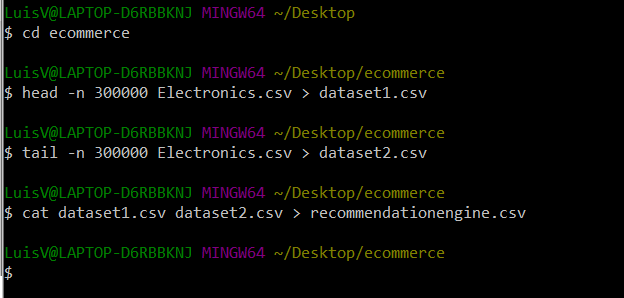
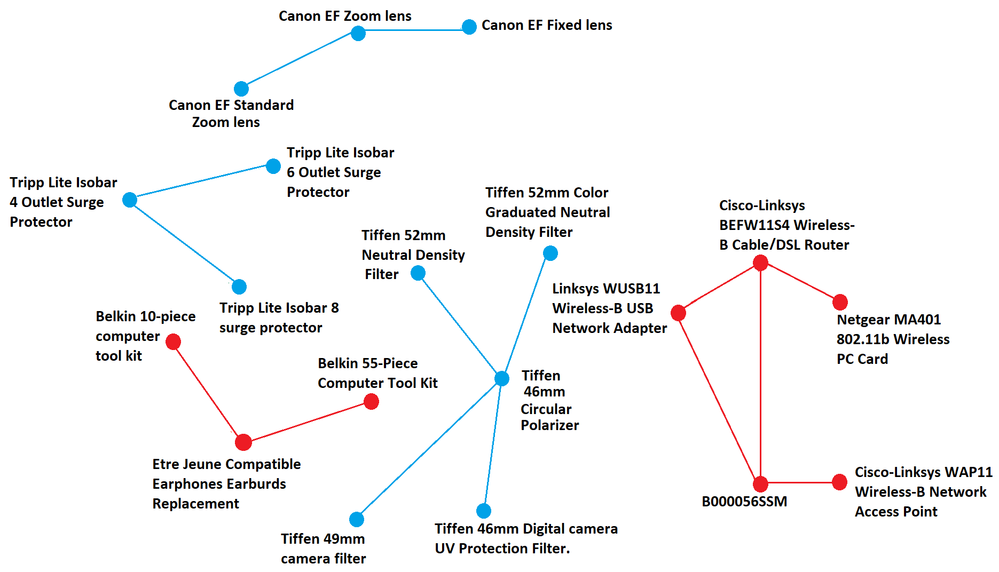

# Market-Basket-Analysis
Use of Machine Learning techniques to create a recommender system
## Project title: Use of machine learning techniques to create a recommender system.

### Author: [Tola Ogunniyi](https://www.linkedin.com/in/tolaogunniyi/)
----

### Date completed: March 26, 2020.

### Introduction:
A key strategy for large retailers is finding the association between different items/products that are purchased by customers. Market Basket analysis lends itself to this particular goal via rules-based learning (i.e. associations rules mining)
Some of the goals that Market basket analysis can help retailers achieve are listed below:
- Recommend products
- Plan a store layout 
- Design sale promotions that combine discounted and marked up items.
- Dicover trigger products(products which when bought together, trigger other purchases) 
----

### Dataset
 I used an Amazon electronics review dataset for my capstone project that I found on [Kaggle](https://www.kaggle.com/saurav9786/amazon-product-reviews). The dataset contained over 1,000,000 rows. I extracted 600,000 rows of the dataset for my capstone project using command line as shown in the image below.

 Command line script to extract 600,000 rows of data I wanted for my capstone project

 
----
### Jupyter notebook 
The project consists of two parts listed below that I completed by launching a jupyter notebook instance on Amazon Sagemaker. 

### Part 1: 
 - Exploratory data analysis (EDA) 

### Part 2:
 - Modeling and extraction of .csv file for network analysis.
 ----
The rules learned from the Market Basket analysis were used to construct the graph shown below. It is a directed graph that consists of 5 main clusters. The different clusters do provide an insight as to how a customer(s) purchased electronic products on Amazon.

 Network analysis or Graph based on associations rules mining

  

### References
- https://www.kaggle.com/saurav9786/recommender-system-using-amazon-reviews
- https://towardsdatascience.com/a-gentle-introduction-on-market-basket-analysis-association-rules-fa4b986a40ce

---

<strong>Thank you very much for taking the time to look at this project. Please feel free to contact me via 
email(tola.ogunniyi1@gmail.com) or [linkedIn](https://www.linkedin.com/in/tolaogunniyi/) if you have any 
questions,comments or feedback</strong>
